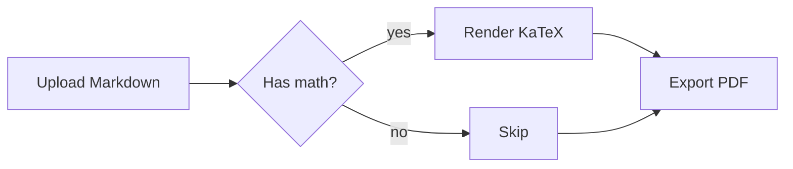

# Mermaid flowchart

Before the diagram.


```mermaid
graph LR
    A[Upload Markdown] --> B{Has math?}
    B -- yes --> C[Render KaTeX]
    B -- no --> D[Skip]
    C --> E[Export PDF]
    D --> E
```

After the diagram. A normal code block follows:

```bash
npm run build
```
