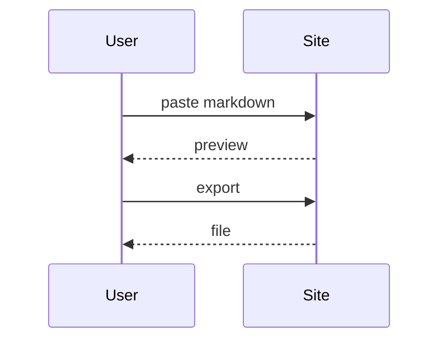

# Mermaid: sequence and class diagrams

Two diagrams in one document:

~~~mermaid
classDiagram
    class Document {
      +String title
      +render()
    }
    class Exporter {
      +toPdf()
    }
    Document --> Exporter
~~~

Done.
