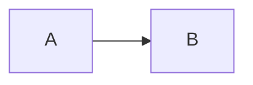

# Code blocks

Inline `code` and `\(not math\)` inside code.

```javascript
const x = "$notMath$";
console.log(`\\[ also not math \\]`);
```

```python
def f(n):
    return sum(range(n))  # $n$ stays literal here
```

```json
{ "a": 1, "b": [true, null] }
```

~~~
~~~ fenced with tildes

~~~

After the tilde block, real math again: $x^2$.
