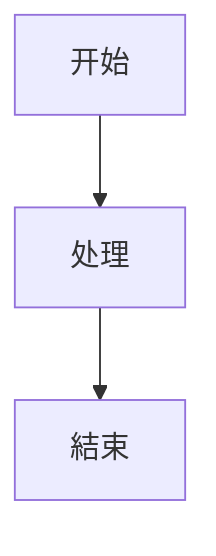

# 混合语言文档 / 多言語ドキュメント / 다국어 문서

中文段落：这是一个测试文档，包含公式 $E = mc^2$ 和表格。

日本語の段落：数式 \( \sum_{i=1}^{n} x_i \) を含みます。

한국어 단락: 수식 $\frac{a}{b}$ 를 포함합니다.

| 语言 | Language | 示例 |
|:-----|:--------:|-----:|
| 中文 | Chinese | 你好 |
| 日本語 | Japanese | こんにちは |
| 한국어 | Korean | 안녕하세요 |

$$
\text{面积} = \pi r^2
$$
