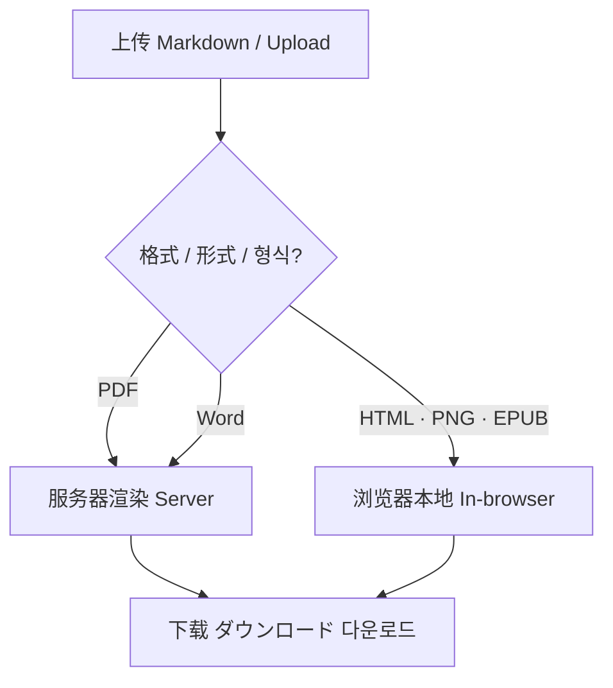
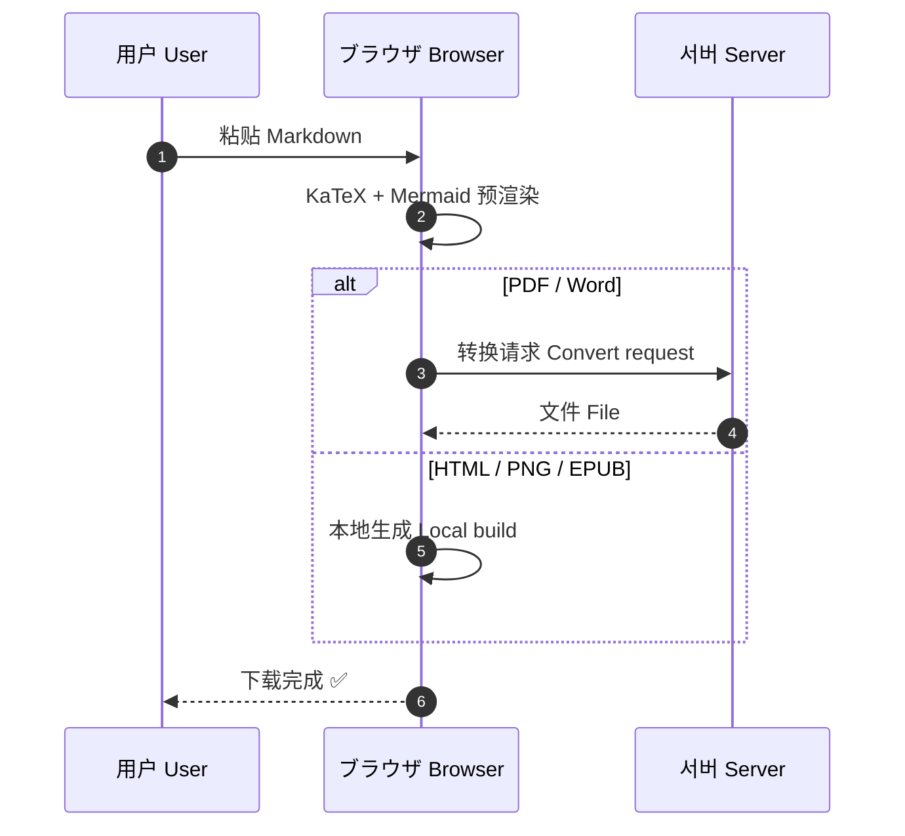
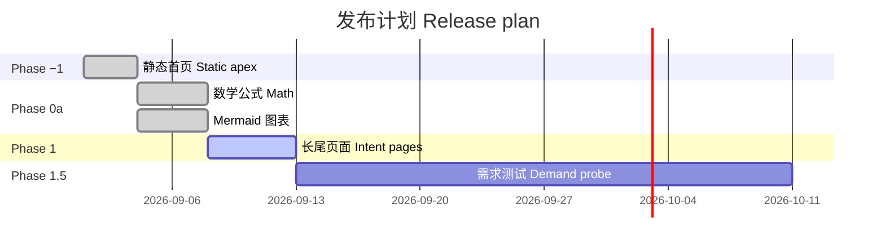
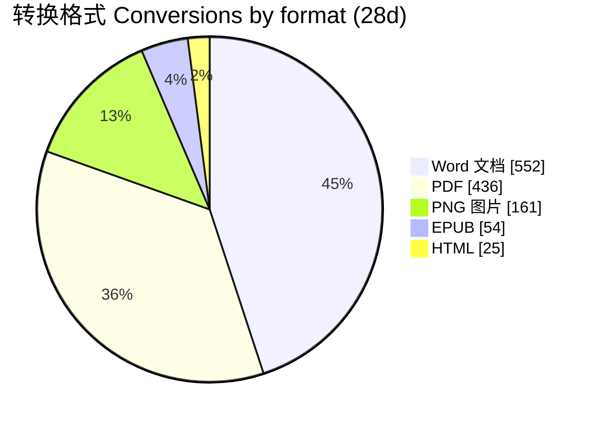
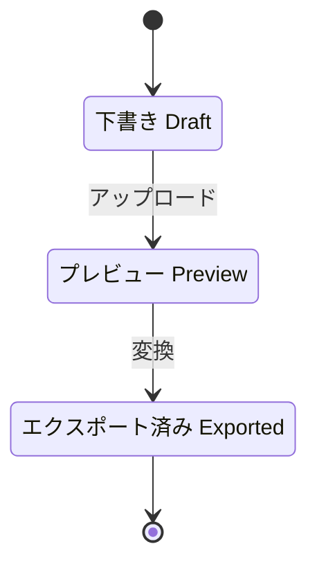
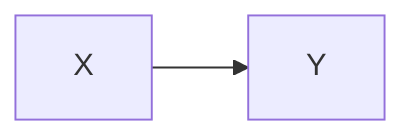

# 综合验证文档 · Validation Kitchen Sink · 検証ドキュメント · 검증 문서

This file exercises math, Mermaid, complex tables and mixed-language text in one document. Lines starting with 🔎 say what to check in the preview and in each export (PDF, Word, HTML, PNG/JPG, EPUB, TXT, Excel).

---

## 1. 数学公式 Math

### 1.1 Inline and display (`$…$` / `$$…$$`)

Einstein's mass–energy relation $E = mc^2$ sits inline, and so does the golden ratio $\varphi = \frac{1+\sqrt{5}}{2}$.

$$
\int_{-\infty}^{\infty} e^{-x^2}\,dx = \sqrt{\pi}
$$

$$
\begin{aligned}
\nabla \cdot \mathbf{E} &= \frac{\rho}{\varepsilon_0} \\
\nabla \times \mathbf{B} &= \mu_0 \mathbf{J} + \mu_0 \varepsilon_0 \frac{\partial \mathbf{E}}{\partial t}
\end{aligned}
$$

$$
A = \begin{pmatrix} 1 & 2 & 3 \\ 4 & 5 & 6 \\ 7 & 8 & 9 \end{pmatrix}, \qquad \det(A) = 0
$$

$$
f(n) = \begin{cases} n/2 & \text{if } n \text{ is even} \\ 3n+1 & \text{if } n \text{ is odd} \end{cases}
$$

$$
\sum_{k=1}^{n} k^2 = \frac{n(n+1)(2n+1)}{6}, \qquad \prod_{p\ \text{prime}} \frac{1}{1-p^{-s}} = \zeta(s)
$$

🔎 All five display formulas render as typeset math (no raw `$$` or backslashes). Word keeps LaTeX source for now; that is expected.

### 1.2 AI-chat delimiters (`\(…\)` / `\[…\]`)

ChatGPT and DeepSeek write inline math like \( e^{i\pi} + 1 = 0 \) and display math like this:

\[
\hat{\beta} = (X^\top X)^{-1} X^\top y
\]

A bracket escape that is NOT math must stay literal: see reference \[1\] and item \[a\].

🔎 The two formulas render; "\[1\]" and "\[a\]" show as plain "[1]" and "[a]".

### 1.3 Currency must not become math

The Plus plan costs $19 per year and the template pack costs $1.99 once.
It was $5 yesterday and $10 today.

🔎 Both lines read as normal text with dollar signs, not italic math.

### 1.4 Math inside CJK text (with and without spaces)

- 中文：勾股定理 $a^2 + b^2 = c^2$ 适用于直角三角形；紧贴汉字的公式$E=mc^2$也应正常显示。
- 繁體：圓面積公式為 $A = \pi r^2$，周長為$C = 2\pi r$。
- 日本語：オイラーの等式 $e^{i\pi}+1=0$ は「最も美しい数式」と呼ばれます。
- 한국어: 근의 공식은 $x = \frac{-b \pm \sqrt{b^2-4ac}}{2a}$ 입니다. 붙여 쓴 경우$y=ax+b$입니다.
- Tiếng Việt: Diện tích hình tròn là $S = \pi r^2$.
- हिन्दी: पाइथागोरस प्रमेय $a^2 + b^2 = c^2$ है।
- Bayes with CJK inside `\text{}`: $P(\text{雨} \mid \text{云}) = \dfrac{P(\text{云} \mid \text{雨})\,P(\text{雨})}{P(\text{云})}$

🔎 Every formula renders, including the ones glued to CJK characters with no space.

### 1.5 Math in lists and quotes

1. Quadratic: $ax^2 + bx + c = 0$
   1. Discriminant $\Delta = b^2 - 4ac$
   2. Two real roots when $\Delta > 0$
2. Limit: $\lim_{x \to 0} \frac{\sin x}{x} = 1$

> 引用中的公式 / A formula in a quote:
>
> $$
> \oint_{\partial \Sigma} \mathbf{B} \cdot d\boldsymbol{\ell} = \mu_0 I
> $$

### 1.6 Code must NOT render as math

Inline code stays literal: `$x^2$`, `\(a+b\)`, `$$E=mc^2$$`.

```latex
% 这是代码块，不是公式
\[ \int_0^1 x\,dx = \tfrac{1}{2} \]
$price = $5 + $10$
```

🔎 The code span and the code block show the dollar signs and backslashes exactly as typed.

---

## 2. Mermaid 图表 Diagrams

### 2.1 Flowchart (CJK labels)



### 2.2 Sequence diagram (mixed languages, alt block)



### 2.3 Gantt chart



### 2.4 Pie chart



### 2.5 State diagram (Japanese)



🔎 Diagrams 2.1–2.5 all render as images, with CJK labels readable (no tofu boxes), in the preview and in every export.

### 2.6 Broken diagram (intentional)

```mermaid
flowchart LR
    A[시작 --> B
```

🔎 This one has a syntax error. It should fall back to a plain code block, and every other diagram must still render.

### 2.7 A Mermaid fence inside another code block (must NOT render)

````markdown

````

🔎 Shows as literal text inside a code block, not as a diagram.

---

## 3. 复杂表格 Complex tables

### 3.1 Alignment + many scripts + math in cells

| Language 语言 | Greeting 问候 | Formula 公式 | Score 分数 |
|:---|:---:|:---:|---:|
| English | Hello, world! | $E = mc^2$ | 98.5 |
| 简体中文 | 你好，世界！ | $\sqrt{2} \approx 1.414$ | 87 |
| 繁體中文 | 你好，世界！ | $\pi r^2$ | 91.25 |
| 日本語 | こんにちは、世界！ | $\sum_{i=1}^{n} i$ | 76 |
| 한국어 | 안녕하세요, 세계! | $\lvert x \rvert \le 1$ | 100 |
| Tiếng Việt | Xin chào thế giới! | $\alpha + \beta$ | 64.3 |
| हिन्दी | नमस्ते दुनिया! | $x^{n}$ | 55 |
| العربية | مرحبا بالعالم! | $\frac{a}{b}$ | 42 |
| עברית | שלום עולם! | $\infty$ | 33 |
| Ελληνικά | Γεια σου κόσμε! | $\Omega$ | 21 |
| Русский | Привет, мир! | $\nabla f$ | 7 |

🔎 Column 1 left-aligned, columns 2–3 centered, Score right-aligned (in HTML, PDF, PNG and EPUB). Math renders inside the cells. Arabic and Hebrew read right to left.

### 3.2 Inline formatting, escaped pipes, links, emoji, empty and ragged rows

| Feature 功能 | Example 示例 | Notes 备注 |
|---|---|---|
| **Bold** / *italic* / ~~strike~~ | **粗体** *斜体* ~~删除线~~ | 太字・굵게 |
| Inline code with a pipe | `a \| b` | GFM needs `\|` inside tables |
| Literal pipe in text | 左 \| 右 | should show one "\|" |
| Link 链接 | [Markdown Free](https://www.markdown.free) | 外部リンク |
| Emoji | 🚀 ✅ 🇯🇵 🇰🇷 🇨🇳 👨‍👩‍👧 | family = ZWJ sequence |
| Empty cell | | ← empty on purpose |
| Ragged row | only one cell here |

🔎 The pipe rows show a literal "|" instead of splitting the cell. The ragged row gets an empty third cell. The link works in HTML and PDF.

### 3.3 Numbers for Table → Excel

| 月份 Month | 转换 Conversions | 占比 Share | 收入 Revenue USD | 变化 Change | 编号 ID |
|:---|---:|---:|---:|---:|:---:|
| 2026-06 | 1,012 | 18.2% | 0.00 | — | 007 |
| 2026-07 | 1,234 | 22.4% | 12.50 | +21.9% | 008 |
| 2026-08 | 1,180 | 21.4% | 9.90 | −4.4% | 009 |
| 2026-09 | 2,089 | 38.0% | 118.80 | +77.0% | 010 |
| **合计 Total** | **5,515** | **100%** | **141.20** | | |

🔎 In the Excel export: one sheet per table, bold total row, and CJK headers intact. Check whether 1,012 and 12.50 come through as numbers and whether "007" keeps its leading zeros.

### 3.4 Wide table (12 columns): overflow in PDF, PNG and EPUB

| # | EN | 简体 | 繁體 | 日本語 | 한국어 | Tiếng Việt | Bahasa Indonesia | Español | Italiano | हिन्दी | Русский |
|---:|---|---|---|---|---|---|---|---|---|---|---|
| 1 | Upload | 上传 | 上傳 | アップロード | 업로드 | Tải lên | Unggah | Subir | Carica | अपलोड | Загрузить |
| 2 | Preview | 预览 | 預覽 | プレビュー | 미리보기 | Xem trước | Pratinjau | Vista previa | Anteprima | पूर्वावलोकन | Просмотр |
| 3 | Export | 导出 | 匯出 | エクスポート | 내보내기 | Xuất | Ekspor | Exportar | Esporta | निर्यात | Экспорт |
| 4 | Download | 下载 | 下載 | ダウンロード | 다운로드 | Tải xuống | Unduh | Descargar | Scarica | डाउनलोड | Скачать |

🔎 No column is cut off at the page edge. It is fine if the table wraps or shrinks.

### 3.5 Long wrapping text in cells

| Scenario 场景 | Description 说明 |
|---|---|
| AI chat export | 用户把 ChatGPT、DeepSeek、Kimi 或豆包的回答复制下来，里面同时包含 LaTeX 公式、代码块和表格，需要一键导出为排版整齐的 PDF 或 Word 文档，发给同事或老师。 |
| 研究ノート | 研究者は Obsidian で書いた長いノートを、数式と図表を保ったまま PDF にして共有したい。セル内の長い日本語テキストが正しく折り返されるかを確認します。 |
| 보고서 | 팀장에게 보낼 주간 보고서를 Markdown으로 작성했습니다. 표 안의 긴 한국어 문장이 잘리지 않고 자연스럽게 줄바꿈되어야 합니다. |
| Long URL | https://www.markdown.free/zh-Hans/markdown-to-pdf-with-latex-math?paper=letter&font=serif&utm_source=validation |

🔎 Long CJK text and the long URL wrap inside the cell rather than overflowing the page.

### 3.6 Merged cells via HTML (known limitation)

<table>
  <tr><th colspan="2">合并表头 Merged header</th></tr>
  <tr><td rowspan="2">跨行 Tall cell</td><td>r1</td></tr>
  <tr><td>r2</td></tr>
</table>

🔎 Expected for now: this HTML table is dropped because raw HTML is disabled until Phase 0b. The text around it must still render.

---

## 4. 多语言正文 Mixed-language prose

**English.** Markdown Free turns a Markdown file into PDF, Word, HTML, images or EPUB in under 30 seconds, with no signup.

**简体中文。** 上传或粘贴 Markdown，预览后即可导出为 PDF、Word、HTML、图片或 EPUB。全角标点“引号”、《书名号》和——破折号应正确显示。

**繁體中文。** 上傳或貼上 Markdown，預覽後即可匯出。「直角引號」與『雙引號』應正常顯示。

**日本語。** Markdown ファイルをアップロードするだけで、PDF や Word に変換できます。半角ｶﾀｶﾅと全角英数字ＡＢＣ１２３も確認してください。

**한국어.** Markdown 파일을 업로드하면 PDF, Word, HTML로 바로 변환할 수 있습니다.

**Tiếng Việt.** Tải lên tệp Markdown và xuất sang PDF chỉ trong vài giây — dấu thanh: ắ ặ ẫ ở ự.

**Bahasa Indonesia.** Unggah berkas Markdown lalu ekspor ke PDF atau Word dengan cepat.

**Español / Italiano.** Convierte Markdown a PDF — ¿funciona con acentos? ¡Sí! · Converti Markdown in PDF: perché no?

**हिन्दी।** मार्कडाउन फ़ाइल अपलोड करें और उसे PDF में बदलें।

**العربية.** قم بتحميل ملف ماركداون وحوّله إلى PDF. (English words inside RTL text: Markdown Free 2026)

**עברית.** העלה קובץ Markdown והמר אותו ל-PDF.

**Ελληνικά / Русский / ไทย.** Μετατροπή σε PDF · Конвертация в PDF · แปลงไฟล์เป็น PDF

### 4.1 Lists, tasks, footnotes

- 第一层 Level 1
  - 第二層 Level 2
    - 第三レベル Level 3
      - 네 번째 Level 4
- [x] 数学公式已验证 Math verified
- [x] Mermaid 図表を確認
- [ ] 표 내보내기 확인 Tables to check
- [ ] EPUB on a phone

Footnotes work across languages.[^zh] 日本語の脚注もあります。[^ja]

[^zh]: 这是一个中文脚注，包含公式 $a \ne b$。
[^ja]: これは日本語の脚注です。

### 4.2 Code with CJK comments

```python
# 计算圆的面积 / 円の面積を計算 / 원의 넓이 계산
import math

def area(r: float) -> float:
    """返回半径为 r 的圆面积。"""
    return math.pi * r ** 2

print(f"面积 = {area(2):.2f}")  # 面积 = 12.57
```

```json
{ "title": "検証", "locale": "ko", "formats": ["pdf", "docx", "png"], "price": "$19" }
```

---

*End of file · 文件结束 · ファイル終了 · 파일 끝*
